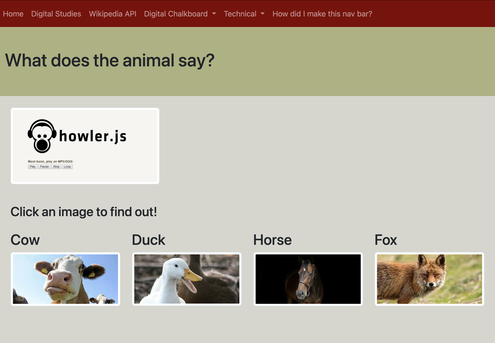
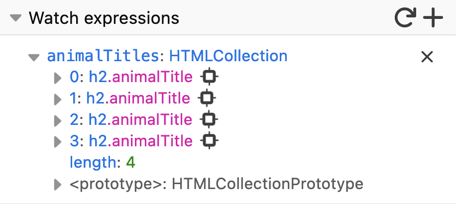

# Create a Howler Page with Four Animal Sounds
This is a rough overview of the Howler example from my GitHub Pages site.

Find the live sample at https://millerpr.github.io/howler.html.




GOAL: write modular code that can be reused for all four animal images and sounds.

Moving Parts:
* Configure the HTML with specific .classes and #IDs.
* Create an HTMLCollection using .getElementsByClassName().
* Create an {Object} based on information from the HTMLCollection.
* Iterate over the {Object} to add event listeners.
* Iterate over the {Object} to add mouse actions.
* Create a Howl object that applies to any of the four animal sounds.

## HTML
```HTML
         <h2 class="animalTitle">Cow</h2>
          
```
Take note of ```<h2 class>``` class and ``````. These are critical. The functions will leverage these.

## Event Listeners
The JavaScript file creates event listeners on the images. The function begins with...
```JavaScript
document.addEventListener('DOMContentLoaded', () => {
```
...and continues all the way down through the mouse handler functions. The only other separate function in this script is the ```playAnimal()``` function.

### Create the HTMLCollection
```JavaScript
var animalTitles = document.getElementsByClassName('animalTitle');
```
This code creates an HTMLCollection containing all the ```<h2>``` elements with this class. You can set a breakpoint and watch for the animalTitles expression.




### Create the Object
```JavaScript
const animalObject = new Object();
  for(element of animalTitles) {
    animalObject[element.nextElementSibling.id] = element.innerHTML
  }
```
This code iterates over each element in the HTMLCollection and creates a property and value. The property is based on the ID of the element **that directly follows** the h2 element on the HTML page. This will be each img element. The property for the first item is animal01. The code then takes the innerHTML of the h2 element as the value of the property. The result is animal01: "Cow" for the first iteration. This demonstrates how to build an Object from data that comes from various parts of the page.

### Create Event Listeners
```JavaScript
for (const property in animalObject){
    document.getElementById(property).addEventListener('click', () => {
      playAnimal(animalObject[property]);
    })
  }
```
This code iterates over each property in the Object. For each iteration, the code gets an element by ID that matches the property (e.g., animal01) and adds an event listener to that element. The event listener uses a click event to run the playAnimal() function.

### Playing the Sound
```JavaScript
function playAnimal(animalSound) {
  var sound = new Howl({
    src: [`media/${animalSound}.mp3`, `media/${animalSound}.webm`],
    sprite: {
      Cow: [0, 3000],
      Duck: [0, 3000],
      Horse: [0, 3000],
      Fox: [37500, 7000],
    }
  });
  sound.play(animalSound);
}
```
Most of this function follows Howler. But notice how we invoke the function in the event listener.
```JavaScript
playAnimal(animalObject[property])
```
We pass the parameter animalObject[property] to the function because this expression will provide the animal name like "Cow" to the path of the sound file in the function. For example, on the first iteration animalObject[property] is "Cow", so the src path to the media file becomes media/Cow.mp3. Notice also when we invoke the sound.play() method from Howler, we pass in the animalSound variable. The animalSound variable Cow matches against the Cow: [0, 3000] property of the Howler sprite object. That's how it knows where to start each audio file and how long to play it (offset and duration).

This allows us to write the playAnimal function once and use it for all the different animal sounds.

### Mouse Behavior
On mouse over, we want to add a solid red border to the image. Then we want that border to go away when the mouse moves away.

We use the Object again to add mouse event listeners to the images. Each listener will launch a function based on mouseOver or mouseOut events.

For each element with an ID that matches a property in the Object, we add two event listeners.
```JavaScript
  for (const property in animalObject){
    document.getElementById(property).addEventListener('mouseover', mouseOverHandler)
    document.getElementById(property).addEventListener('mouseout', mouseOutHandler)
  }
```

When we move our mouse over or out of an image, the border of that image changes based on the following functions.
```JavaScript
function mouseOverHandler() {
    this.style.border = '3px solid red';
  }
  function mouseOutHandler() {
    this.style.border = '0px';
  }
```

The key takeaway here is to understand how the Object is being built from data embedded in the HTML page, then how this allows us to write modular functions and listeners to be applied to all four images. The less modular and less desirable approach would be to write a separate Howl object for each image.
